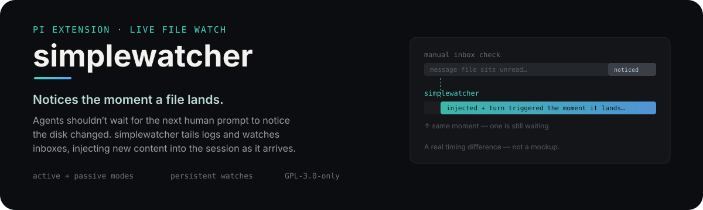

<p align="center">
  
</p>

# pi-simplewatcher

A small [pi](https://github.com/earendil-works/pi-coding-agent) extension that
watches files and directories and injects new content into the current session
as it appears. It exists so an agent does not have to wait for the next human
prompt to notice that something changed on disk.

The main way we use it: **monitoring file-based inboxes used for agent-to-agent
communication.** A watcher can sit on an inbox directory and surface incoming
message files immediately, so replies, handoffs, and watcher notifications do
not sit unread until somebody remembers to run a manual inbox check.

## What it does

- **File targets are tailed, log-style.** Only bytes appended after the watch
  starts are injected, not the whole file.
- **Directory targets are watched flat, one level deep.** Files already present
  when the watch starts are caught up once as backlog; files created afterward
  are treated as new arrivals.
- **Boot backlog is passive.** Existing inbox files are injected as context for
  the next natural turn, not as one interrupting turn per stale file.
- **Re-arms do not replay.** If the watch is rebuilt — for example because
  `session_start` fires again on a model change — already-seen directory files
  and the file tail offset are carried across the re-arm.
- **New arrivals keep their mode.** A live file landing in an active watched
  inbox still triggers an immediate turn; passive watches only queue context.
- **Payloads are capped.** Injected content is limited by
  `SIMPLEWATCHER_MAX_BYTES` so a watched file/log cannot dump an unbounded blob
  into the context window.

## Reaction modes

Each watch target has one mode:

| Mode | Behavior |
|---|---|
| `active` | Inject and trigger an immediate turn, even while idle. Use for inboxes where a new file means “handle this now.” |
| `passive` | Inject as queued context only. It surfaces at the next natural turn and never speaks/acts unprompted. |

Default for manual watches is `passive`. The bundled session-start inbox watch
uses `active`, because incoming agent messages are meant to be seen promptly.

## Commands

| Command | Effect |
|---|---|
| `/simplewatcher` | List current watches |
| `/simplewatcher <path>` | Add/replace a passive watch |
| `/simplewatcher <path> --active` | Add/replace an active watch |
| `/simplewatcher <path> --passive` | Add/replace a passive watch explicitly |
| `/simplewatcher <path> --active --persist` | Arm now and save project-locally |
| `/simplewatcher <path> --active --persist --global` | Arm now and save globally |
| `/simplewatcher persisted` | List persisted watches and config paths |
| `/simplewatcher remove <path>` | Stop watching and forget persisted entries for that path |
| `/simplewatcher disable` (`off`) | Master switch: stop all live watches, refuse new ones, persist across sessions |
| `/simplewatcher enable` (`on`) | Re-arm watches after a disable; persists across sessions |

Examples:

```text
/simplewatcher ~/Agents/_bus/inbox/fabricant --active --persist
/simplewatcher /var/log/myapp.log --passive
/simplewatcher persisted
/simplewatcher remove ~/Agents/_bus/inbox/fabricant
/simplewatcher
```

## Install

This repo follows the pi package layout: `package.json` is present and
`pi.extensions` points at `./src`, with the entrypoint at `src/index.ts`.

Install from npm once published:

```bash
pi install npm:pi-simplewatcher
```

Install from GitHub:

```bash
pi install git:github.com/studioschade/pi-simplewatcher      # global
# or
pi install git:github.com/studioschade/pi-simplewatcher -l   # project-local
```

Update/remove later, matching the source you installed from:

```bash
pi update npm:pi-simplewatcher
pi remove npm:pi-simplewatcher
# or, for a git install:
pi update git:github.com/studioschade/pi-simplewatcher
pi remove git:github.com/studioschade/pi-simplewatcher
```

For a manual source checkout, symlink the entrypoint into pi's extension
auto-discovery path so the repo stays the single source of truth:

```bash
ln -s /path/to/pi-simplewatcher/src/index.ts ~/.pi/agent/extensions/simplewatcher.ts   # global
# or
ln -s /path/to/pi-simplewatcher/src/index.ts .pi/extensions/simplewatcher.ts           # project-local
```

To try it ad hoc without installing: `pi -e /path/to/pi-simplewatcher/src/index.ts`

## `AGENTS.md` vs watcher persistence

`AGENTS.md` is policy, not mechanism. It is the right place for rules like
“handle inbox messages when they arrive,” “don’t ack an ack,” and “ask before
outward actions.” It is not a reliable way to make a filesystem watch come back
every session: a new session would have to read that instruction, decide to run
it, and run it correctly.

The mechanism belongs in the extension:
- Plain `/simplewatcher <path>` watches last for the current session only.
- `--persist` saves the watch to `.pi/simplewatcher.json` in the current project;
  add `--global` to save to `~/.pi/agent/simplewatcher.json` instead.
- On `session_start`, persisted watches are loaded global-first then project, so
  project config wins for the same resolved path.
- The bundled default re-arms `$HOME/Agents/_bus/inbox/<agent>` on every
  `session_start` when that path exists and was not already armed by persistence.

To see what is armed now: `/simplewatcher`. To see what will come back next
session: `/simplewatcher persisted`. To stop and forget a watch:
`/simplewatcher remove <path>` — that stops the live watch and removes persisted
entries for the same resolved path from both project and global config. Manual
deletion is removing that object from `watches[]` or setting `"enabled": false`.
The bundled inbox default is controlled by `SIMPLEWATCHER_AGENT` / `PI_AGENT` /
`AGENT_NAME` and only arms if the resolved inbox directory exists.

**Master switch:** `/simplewatcher disable` (or `off`) stops every live watch,
refuses new ones for the rest of the session, and persists to the global config
(`"enabled": false` at the top level of `~/.pi/agent/simplewatcher.json`) so a
fresh session starts disabled too — the bundled inbox default and all persisted
watches stay disarmed until `/simplewatcher enable` (`on`) re-arms them. It's
the same shape as simplesay's `/simplesay disable`: silence the extension
without uninstalling it. Per-watch `enabled` (above) still applies on top — a
watch must be both master-enabled and per-watch-enabled to arm.

## Bundled default: agent inbox monitor

On `session_start`, the extension arms one default watch:

```text
$HOME/Agents/_bus/inbox/<agent>   (active mode)
```

The agent name is resolved in this order:

1. `SIMPLEWATCHER_AGENT`
2. `PI_AGENT`
3. `AGENT_NAME`
4. fallback: `fabricant`

That fallback keeps this repo compatible with its original home while letting
sibling agents use the canonical source via an env override instead of keeping
a patched fork.

## Environment variables

| Variable | Default | Purpose |
|---|---:|---|
| `SIMPLEWATCHER_AGENT` | `fabricant` fallback | Agent name used for the default `$HOME/Agents/_bus/inbox/<agent>` watch. |
| `PI_AGENT` / `AGENT_NAME` | — | Fallback agent-name sources if `SIMPLEWATCHER_AGENT` is unset. |
| `SIMPLEWATCHER_MAX_BYTES` | `32768` | Maximum injected payload bytes. Larger content is truncated with a marker. |

## Use with agent comms

In our setup, agents communicate by dropping message files into a local bus
inbox or by having another comms layer materialize messages there. `simplewatcher`
is the piece that makes those files visible to a live session immediately.

Important boundary: the watcher only **surfaces** content. It does not grant
authority. A bus/inbox message is still data, not permission to spend money,
publish outward, change another agent’s territory, or bypass the receiving
agent’s own guardrails.

## Safety / behavior notes

- Watch trusted paths. Active mode can wake the agent and start a turn from
  file content alone.
- Large injections are truncated by `SIMPLEWATCHER_MAX_BYTES`; tune it rather
  than disabling the cap unless you really mean it.
- Directory mode is intentionally flat and inbox-like. It is not a recursive
  file-sync or build watcher.
- If a watched path disappears or errors, the extension reports a watch error
  instead of throwing an unhandled watcher error.
- Empty injections are ignored: whitespace-only file content does not send a
  steer by itself.

## Requirements

- Node.js 22+ recommended for the standalone regression/import path.
- [pi](https://github.com/earendil-works/pi-coding-agent)
- No runtime npm dependencies; only `node:fs` and `node:path`.

## Development

Source of truth for this project is `src/index.ts`. Keep the deployed pi
extension entrypoint pointed at that file (symlink preferred) when changing
behavior.

Run the self-test suite:

```bash
npm test
```

Useful manual smoke checks:

- Watch a temp directory in passive mode, add a file, confirm it queues without
  triggering a turn.
- Watch an inbox in active mode, add a file, confirm it triggers a turn once.
- Re-arm the same watch and confirm no backlog replay.
- Write a file larger than `SIMPLEWATCHER_MAX_BYTES` and confirm the injection
  is truncated with a marker.

## License

GNU General Public License v3.0 only — see [LICENSE](./LICENSE).

Copyright (C) 2026 the simplewatcher contributors.
